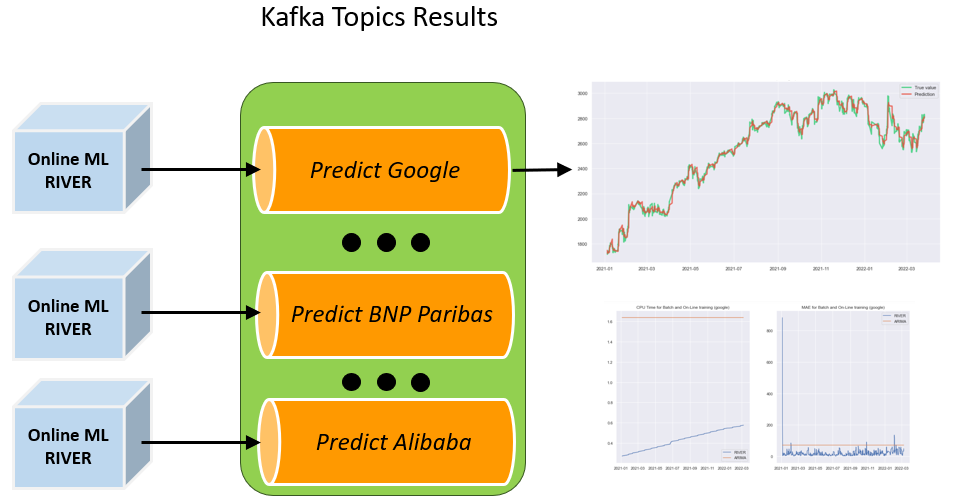

# Data streams processing project

## Real-time streaming application with Kafka 

</img>

Authors : __Cyril Nérin - Hugo Rialan - Alexandre Perbet__

--- 
### Project Description 
The objective of the project is to predict markets stocks using online regression tools
The stock exchange rates used are as follows : Google, Facebook, Amazon, Total, Gazprom, Alibaba, BNP Paribas, Ferrari

We first developed a batch regression solution. Then, we developed an online solution using river and Kafka.

--- 
### Project Architecture

The project was carried out on Jupyter notebooks to improve the visibility of the results obtained. 

3 notebooks are available : 

- The **first** one contains the data ingestion and an implementation of the ARIMA algorithm for the batch part.
  

  </img>
  

  
- The **second** one contains the online learning prediction algorithm implemented with River.
  

  </img>
  

- The **third** one allows to display and plot the obtained results.
  

  </img>
  

  
 --- 
### Results 

- [BP](https://hrialan.github.io/m2ds-data-stream-project/HTML/3-BP__NERIN_PERBET_RIALAN__Datastream_sujet_5__Plot.html)
- [Alibaba](https://hrialan.github.io/m2ds-data-stream-project/HTML/3-alibaba__NERIN_PERBET_RIALAN__Datastream_sujet_5__Plot.html)
- [Amazon](https://hrialan.github.io/m2ds-data-stream-project/HTML/3-amazon__NERIN_PERBET_RIALAN__Datastream_sujet_5__Plot.html)
- [BNP Paribas](https://hrialan.github.io/m2ds-data-stream-project/HTML/3-bnp_paribas__NERIN_PERBET_RIALAN__Datastream_sujet_5__Plot.html)
- [Facebook](https://hrialan.github.io/m2ds-data-stream-project/HTML/3-facebook__NERIN_PERBET_RIALAN__Datastream_sujet_5__Plot.html)
- [Ferrari](https://hrialan.github.io/m2ds-data-stream-project/HTML/3-ferrari__NERIN_PERBET_RIALAN__Datastream_sujet_5__Plot.html)
- [Gazprom](https://hrialan.github.io/m2ds-data-stream-project/HTML/3-gazprom__NERIN_PERBET_RIALAN__Datastream_sujet_5__Plot.html)
- [Google](https://hrialan.github.io/m2ds-data-stream-project/HTML/3-google__NERIN_PERBET_RIALAN__Datastream_sujet_5__Plot.html)
- [Total](https://hrialan.github.io/m2ds-data-stream-project/HTML/3-total__NERIN_PERBET_RIALAN__Datastream_sujet_5__Plot.html)

 --- 
### Requirements

It is assumed that Zookeeper is running default on localhost:2181 and Kafka on localhost:9092 before running the notebooks.
